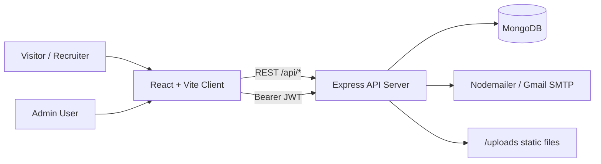
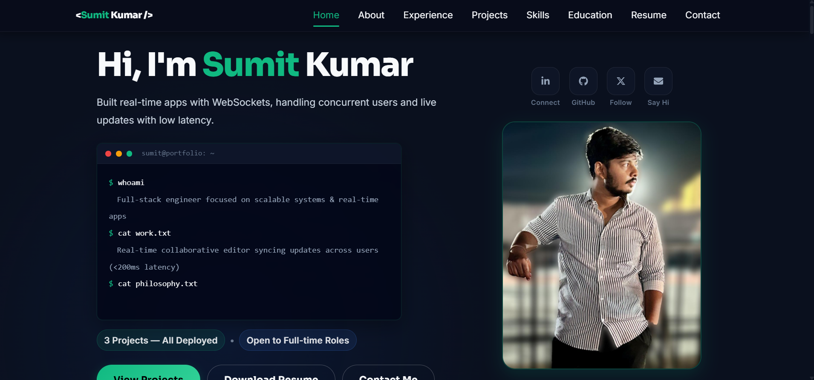

# Sumit Kumar Portfolio Website

[](https://github.com/imsumit28/portfolio-website/actions/workflows/ci.yml)

Production portfolio application with a React frontend and Node/Express backend.

## Why this repo exists

This project is designed to showcase both UI quality and engineering fundamentals:
- clear frontend information architecture
- authenticated admin workflows
- persistent project/contact data
- pragmatic backend security controls (JWT + rate limiting)

## Architecture



Detailed diagrams: [docs/architecture.md](./docs/architecture.md)

### High-level request flow
1. Client sends API requests through `client/src/utils/api.js`.
2. Server routes requests in `server/routes/*`.
3. Protected routes use JWT middleware (`server/middleware/auth.js`).
4. Data is persisted via Mongoose models in `server/models/*`.
5. Contact form additionally sends an email notification through Nodemailer.

## Repository structure

```text
portfolio-website/
  client/                    # React + Vite frontend
    src/
      components/            # Reusable UI blocks (navbar, forms, lists)
      pages/                 # Route and section-level pages
      utils/api.js           # Axios instance + auth token interceptor
  server/                    # Express backend
    routes/                  # auth, projects, contact APIs
    models/                  # MongoDB schemas
    middleware/              # auth + file upload middleware
    server.js                # app bootstrap + DB connection
```

## Tech stack

- Frontend: React 18, Vite, Bootstrap, React Router
- Backend: Node.js, Express, Mongoose
- Database: MongoDB
- Auth: JWT (Bearer token)
- Ops helpers: Multer (uploads), Nodemailer (contact emails), express-rate-limit

## Local setup

### Prerequisites
- Node.js 18+
- MongoDB running locally or a MongoDB Atlas URI

### 1. Clone and install

```bash
git clone https://github.com/imsumit28/portfolio-website.git
cd portfolio-website
cd client && npm install
cd ../server && npm install
```

### 2. Configure environment

Create `server/.env`:

```env
PORT=5000
MONGODB_URI=mongodb://127.0.0.1:27017/portfolio
JWT_SECRET=replace_with_a_long_random_secret
EMAIL_USER=your_email@gmail.com
EMAIL_PASS=your_gmail_app_password
```

Optional client env (`client/.env`):

```env
VITE_API_URL=http://localhost:5000/api
```

If `VITE_API_URL` is not set, the client defaults to `http://localhost:5000/api`.

### 3. Run development servers

Terminal 1:
```bash
cd server
npm start
```

Terminal 2:
```bash
cd client
npm run dev
```

Open: `http://localhost:5173`

## API overview

### Auth
- `POST /api/auth/register` - create user
- `POST /api/auth/login` - login and receive JWT
- `GET /api/auth/user` - get current user (protected)

### Projects
- `GET /api/projects` - list projects
- `GET /api/projects/:id` - get one project (protected)
- `POST /api/projects` - create project with optional image upload (protected)
- `PUT /api/projects/:id` - update project (protected)
- `DELETE /api/projects/:id` - delete project (protected)

### Contact
- `POST /api/contact` - submit contact message (rate limited)
- `GET /api/contact` - list messages (protected)
- `PUT /api/contact/:id/read` - mark message as read (protected)

## Engineering decisions

1. JWT auth with request interceptor
- Decision: store token client-side and attach it automatically in Axios interceptor.
- Why: keeps protected route calls simple and avoids repeating auth plumbing across components.

2. Rate limiting on public contact endpoint
- Decision: apply `express-rate-limit` on `POST /api/contact`.
- Why: prevents spam bursts and protects SMTP quota.

3. Hybrid projects source on frontend
- Decision: merge static `LOCAL_PROJECTS` with API projects in `Projects.jsx`.
- Why: portfolio stays populated even when backend/API is unavailable.

4. File upload abstraction
- Decision: isolate upload behavior in `server/middleware/upload.js` and expose `/uploads` statically.
- Why: keeps route handlers focused on business logic and supports project image management.

## Current limitations / next improvements

- Test coverage is currently minimal (health smoke test only).
- CORS currently uses default `app.use(cors())`; production should restrict origins.
- Admin bootstrap is manual (no seed script yet).

## Screenshots



## Contact

- LinkedIn: https://linkedin.com/in/imsumit45/
- GitHub: https://github.com/imsumit28
- Email: ersumitkumar45@gmail.com

## Project hygiene

- Contribution guide: [CONTRIBUTING.md](./CONTRIBUTING.md)
- License: [MIT](./LICENSE)
