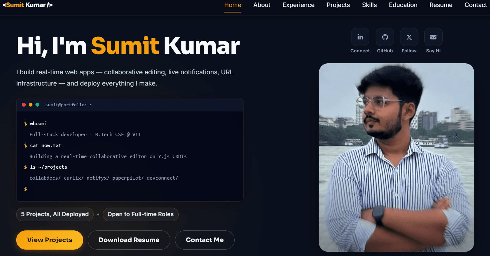
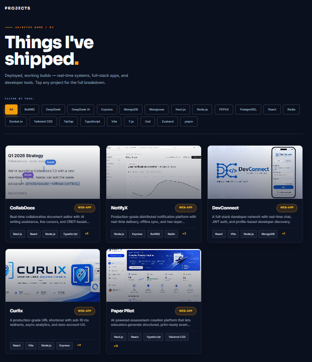
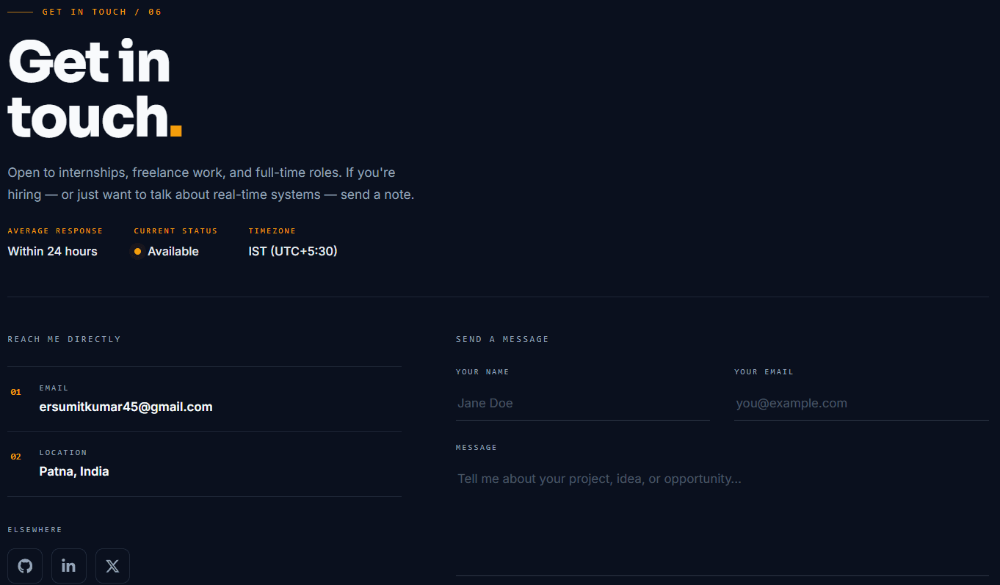
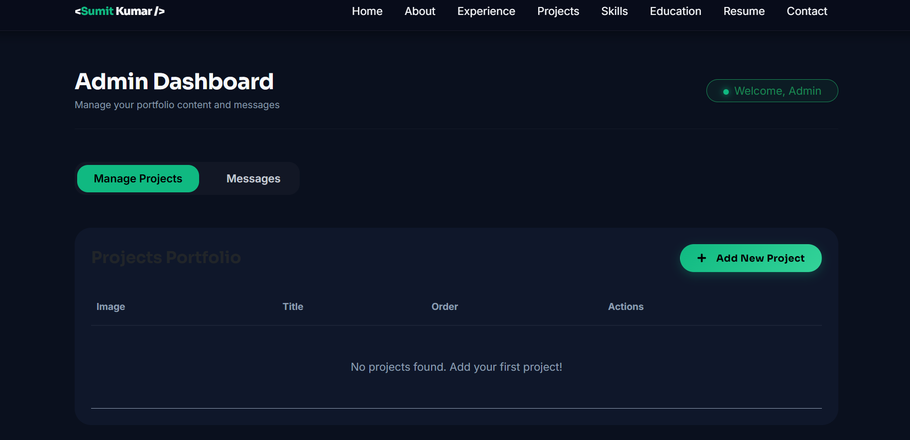

# Sumit Kumar Portfolio Website

Full-stack portfolio application with a React/Vite frontend and Express API backend.

## Stack
- Frontend: React 18, Vite, Bootstrap, Axios
- Backend: Express, Mongoose, JWT auth, Multer uploads
- Database: MongoDB
- CI: GitHub Actions (server test suite)

## Architecture
- `client/` serves the portfolio UI and admin pages.
- `server/` exposes REST APIs under `/api/*`.
- Public project cards are rendered from local static project metadata with optional API-augmented project entries.
- Contact form requests are persisted in MongoDB and optional notification delivery is handled server-side via Web3Forms.

## Security Controls
- JWT-protected admin routes (`/api/projects/*`, `/api/contact/*` read/update paths)
- Route-level and global rate limiting
- Input validation for auth and contact endpoints
- CORS allowlist via `CLIENT_URL`

## Environment Variables
Create `server/.env`:

```env
PORT=5000
MONGODB_URI=mongodb://127.0.0.1:27017/portfolio
JWT_SECRET=replace_with_a_long_random_secret
CLIENT_URL=http://localhost:5173
WEB3FORMS_ACCESS_KEY=optional_web3forms_key
```

Create `client/.env`:

```env
VITE_API_URL=http://localhost:5000/api
```

## Local Development
```bash
# from repo root
cd client && npm install
cd ../server && npm install

# terminal 1
cd server
npm run dev

# terminal 2
cd client
npm run dev
```

## Testing
```bash
cd server
npm test
```

## Deployment
- Frontend: Vercel (`client/` root)
- Backend: Render (`server/` root)
- Keep `CLIENT_URL` and `VITE_API_URL` aligned

## Screenshots

| Home | Projects |
| --- | --- |
|  |  |

| Contact | Admin Dashboard |
| --- | --- |
|  |  |

## Notes
- Do not expose third-party form keys in frontend code.
- If `WEB3FORMS_ACCESS_KEY` is unset, contact submissions still persist to MongoDB.

## Links
- [Architecture](./docs/architecture.md)
- [Performance](./docs/performance.md)
- [Contributing](./docs/CONTRIBUTING.md)
- [Resume (PDF)](./docs/Sumit_Kumar_Full_Stack_Developer_Resume.pdf)
