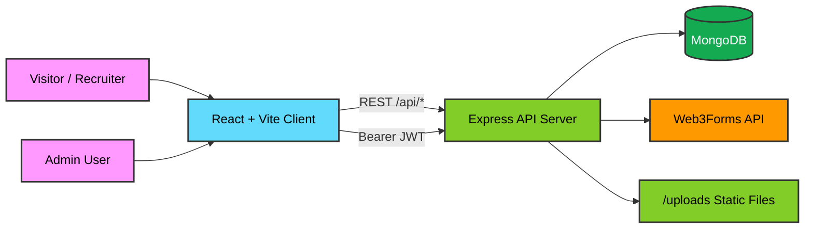

<div align="center">
  <h1>Sumit Kumar's Portfolio</h1>
  <p>A production-ready portfolio application featuring a React frontend and a Node/Express backend.</p>

  [](https://github.com/imsumit28/portfolio-website/actions/workflows/ci.yml)
  [](https://reactjs.org/)
  [](https://nodejs.org/)
  [](https://mongodb.com/)
</div>

<hr />

## Overview

This project is more than just a portfolio—it's a demonstration of UI quality, engineering fundamentals, and full-stack development best practices. It includes:
- **Clean Frontend Architecture**: Built with React, Vite, and Bootstrap for a snappy, responsive experience.
- **Authenticated Admin Workflows**: Secure dashboard to manage projects and contact requests.
- **Persistent Data**: MongoDB integration for reliable data storage.
- **Pragmatic Security Controls**: JWT-based authentication and rate limiting to protect endpoints.

---

## Architecture

The application follows a standard MERN stack architecture, decoupled into a distinct client and API server.


```mermaid
flowchart LR
    %% Define styles
    classDef user fill:#f9f,stroke:#333,stroke-width:2px,color:#000;
    classDef client fill:#61dafb,stroke:#333,stroke-width:2px,color:#000;
    classDef server fill:#83cd29,stroke:#333,stroke-width:2px,color:#000;
    classDef db fill:#13aa52,stroke:#333,stroke-width:2px,color:#fff;
    classDef ext fill:#ff9900,stroke:#333,stroke-width:2px,color:#000;

    %% Nodes
    U[Visitor / Recruiter]:::user
    A[Admin User]:::user
    C[React + Vite Client]:::client
    S[Express API Server]:::server
    M[(MongoDB)]:::db
    E[Web3Forms API]:::ext
    F["/uploads Static Files"]:::server

    %% Connections
    U --> C
    A --> C
    C -->|REST /api/*| S
    C -->|Bearer JWT| S
    S --> M
    S --> E
    S --> F
```

### High-Level Request Flow
1. **Client Layer**: The client sends API requests through an Axios instance (`client/src/utils/api.js`) which automatically attaches auth tokens.
2. **Routing**: The server handles incoming requests in `server/routes/*`.
3. **Security**: Protected routes use JWT middleware (`server/middleware/auth.js`) to verify identities.
4. **Data Layer**: Data is structured and persisted using Mongoose models (`server/models/*`).
5. **External Services**: Contact form submissions trigger email notifications via the Web3Forms API.

---

## Engineering Decisions

Every technical choice in this project was made with a focus on maintainability, performance, and security. Here is the *why* behind the code:

### 1. JWT Auth with Request Interceptors
- **Decision**: Store the authentication token client-side and attach it automatically via an Axios interceptor.
- **Why**: This pattern keeps protected route calls simple, prevents repetitive auth boilerplate across components, and ensures all outbound authenticated requests are securely signed.

### 2. Rate Limiting on Public Endpoints
- **Decision**: Apply `express-rate-limit` on `POST /api/contact`.
- **Why**: Public-facing forms are prime targets for bots. Rate limiting prevents spam bursts, protecting the server from being overwhelmed and preserving SMTP email quotas.

### 3. Hybrid Projects Source on Frontend
- **Decision**: Merge static `LOCAL_PROJECTS` with dynamically fetched API projects in `Projects.jsx`.
- **Why**: High availability. Even if the backend API goes down or experiences latency, the portfolio remains populated and fully functional for visitors and recruiters.

### 4. File Upload Abstraction
- **Decision**: Isolate file upload behavior within `server/middleware/upload.js` and serve `/uploads` statically.
- **Why**: This separation of concerns keeps route handlers focused strictly on business logic, making the codebase easier to read and test, while providing a streamlined way to manage dynamic project images.

### 5. Web3Forms Email Delivery
- **Decision**: Replaced traditional Nodemailer SMTP with the Web3Forms HTTP API.
- **Why**: Cloud platforms like Render frequently block outbound SMTP connections (like Gmail) on free tiers, causing requests to time out. Using a native `fetch` call to Web3Forms bypasses SMTP completely, ensuring fast and reliable email notifications.

---

## Deployment Guide

This project is configured for split deployment: **Vercel** for the frontend and **Render** for the backend.

### Backend (Render)
1. **Setup**: Create a new Web Service, set the root directory to `server`, and use `npm start` as the start command.
2. **Environment Variables**: Include `MONGODB_URI` (Atlas connection string), `JWT_SECRET`, and `CLIENT_URL` (your Vercel URL).
3. **Important Configurations**:
   - The server explicitly binds to `0.0.0.0` in `server.js` for compatibility with Render.
   - To prevent the free tier from spinning down after 15 minutes of inactivity, set up a free [Cron-job.org](https://cron-job.org) ping to hit the root `GET /` endpoint every 14 minutes.

### Frontend (Vercel)
1. **Setup**: Create a new project, set the root directory to `client`, and select the Vite framework preset.
2. **Environment Variables**: Set `VITE_API_URL` to your Render backend URL **with the `/api` suffix** (e.g., `https://portfolio-backend.onrender.com/api`).
3. **Routing**: The `client/vercel.json` file is included to rewrite all requests to `index.html`, fixing the common "404 NOT_FOUND" error on page refresh for React Single Page Applications.

### Live Admin Setup
When deploying to a new cloud database (like MongoDB Atlas), the database starts empty. To create your first admin user on the live site:
1. Go to your live Vercel website.
2. Open the browser Developer Tools -> Console.
3. Run this script (changing the email and password to your preference):
   ```javascript
   fetch("https://your-render-url.onrender.com/api/auth/register", {
     method: "POST",
     headers: { "Content-Type": "application/json" },
     body: JSON.stringify({ email: "admin@example.com", password: "your_secure_password" })
   }).then(r => r.json()).then(console.log);
   ```
4. Navigate to `/admin/login` and log in with those credentials.

---

## How to Run Locally

Get the project up and running on your local machine in three simple steps.

### Prerequisites
- [Node.js](https://nodejs.org/) (v18 or higher)
- [MongoDB](https://www.mongodb.com/) (running locally or an Atlas URI)
- Git

### 1. Clone & Install Dependencies
```bash
# Clone the repository
git clone https://github.com/imsumit28/portfolio-website.git
cd portfolio-website

# Install frontend dependencies
cd client && npm install

# Install backend dependencies
cd ../server && npm install
```

### 2. Configure Environment Variables
Create a `.env` file in the `server` directory:
```env
PORT=5000
MONGODB_URI=mongodb://127.0.0.1:27017/portfolio
JWT_SECRET=your_super_secret_jwt_key
```

*(Optional)* Create a `.env` file in the `client` directory:
```env
VITE_API_URL=http://localhost:5000/api
```

### 3. Start the Development Servers
You will need two terminal windows.

**Terminal 1: Start the Backend**
```bash
cd server
npm run dev
```

**Terminal 2: Start the Frontend**
```bash
cd client
npm run dev
```
Open your browser and navigate to **[http://localhost:5173](http://localhost:5173)** to see the app live!

---

## Screenshots

| Home Page | Admin Dashboard |
| :---: | :---: |
|  |  |
| **Projects Gallery** | **Contact Form** |
|  |  |

*(Note: Create a `docs/screenshots` folder and add your images with these names to populate this section)*

---

## Admin Access (Local)
To access the admin dashboard locally:
1. Start both servers.
2. Create an admin user by sending a POST request:
   ```bash
   curl -X POST http://localhost:5000/api/auth/register \
     -H "Content-Type: application/json" \
     -d "{\"email\":\"admin@example.com\",\"password\":\"StrongPass123!\"}"
   ```
3. Navigate to `http://localhost:5173/admin/login` and log in with the created credentials.

---

## Contact & Connect

- **LinkedIn**: [linkedin.com/in/imsumit45](https://linkedin.com/in/imsumit45/)
- **GitHub**: [imsumit28](https://github.com/imsumit28)
- **Email**: [ersumitkumar45@gmail.com](mailto:ersumitkumar45@gmail.com)

---

## Project Documents

- [Architecture](./docs/architecture.md)
- [Contributing Guide](./docs/CONTRIBUTING.md)
- [License (MIT)](./LICENSE)
- [Resume (PDF)](./docs/Sumit_Kumar_Full_Stack_Developer_Resume.pdf)

---
*Built by Sumit Kumar - Full Stack Developer*
