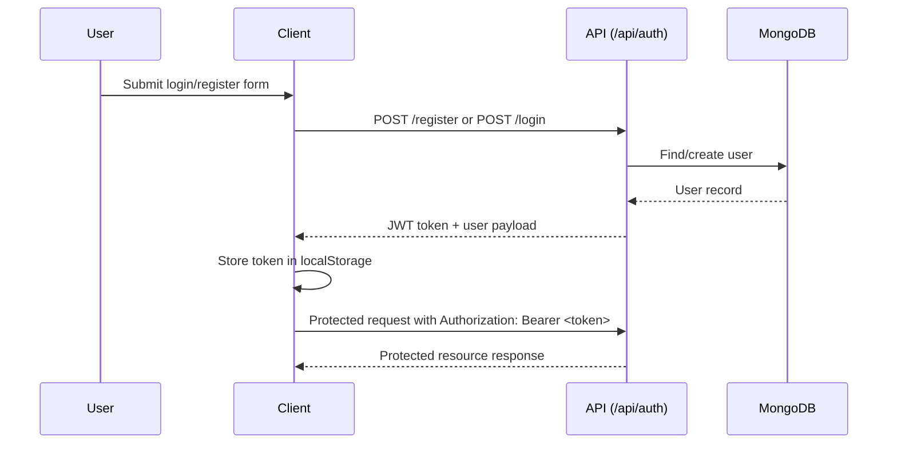
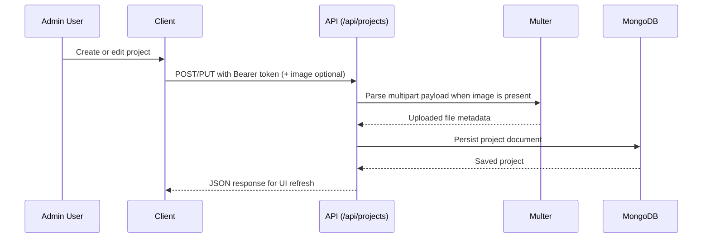
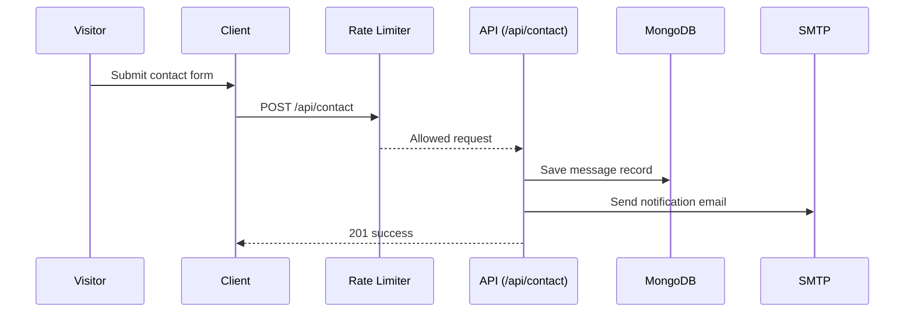

# Architecture Deep Dive

This document explains the request lifecycle and key backend flows.

## System context

```mermaid
flowchart LR
  Browser[Browser Client] -->|HTTP| Frontend[React + Vite]
  Frontend -->|REST /api/*| API[Express API]
  API --> DB[(MongoDB)]
  API --> Mail[SMTP via Nodemailer]
  API --> Files[/uploads]
```

## Auth flow



## Project CRUD flow



## Contact submission flow



## Design notes

- Client-side token attachment is centralized in `client/src/utils/api.js` interceptor.
- Route-level concerns are split by domain (`auth`, `projects`, `contact`) to keep handlers focused.
- Public contact endpoint is protected by rate limiting to reduce abuse.
- File uploads are isolated behind middleware for cleaner route handlers.
